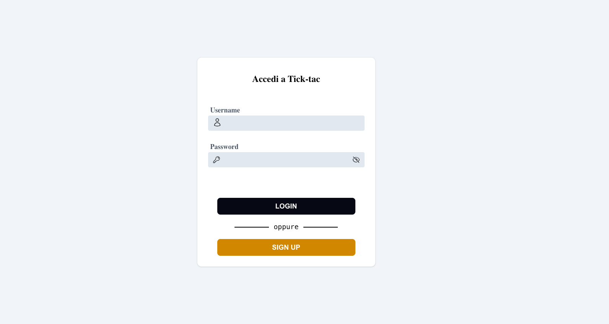
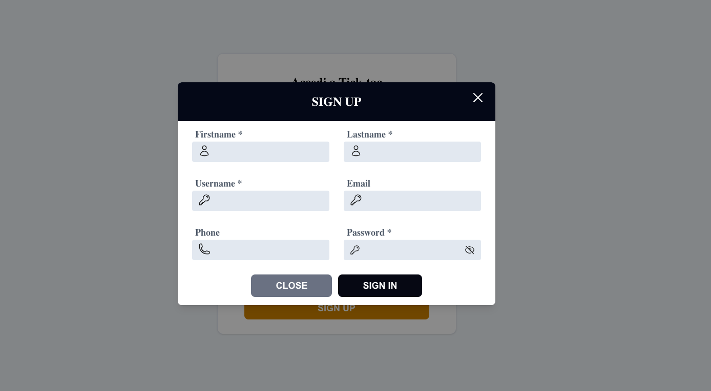
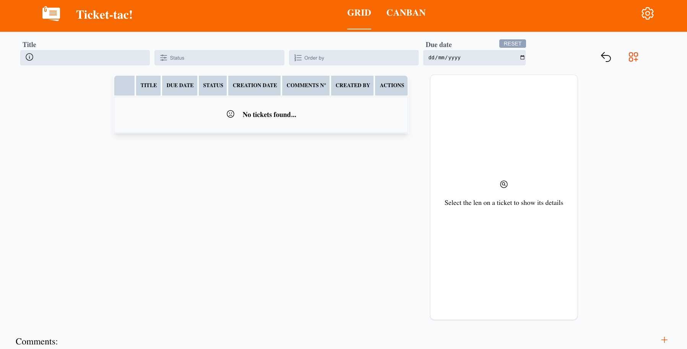
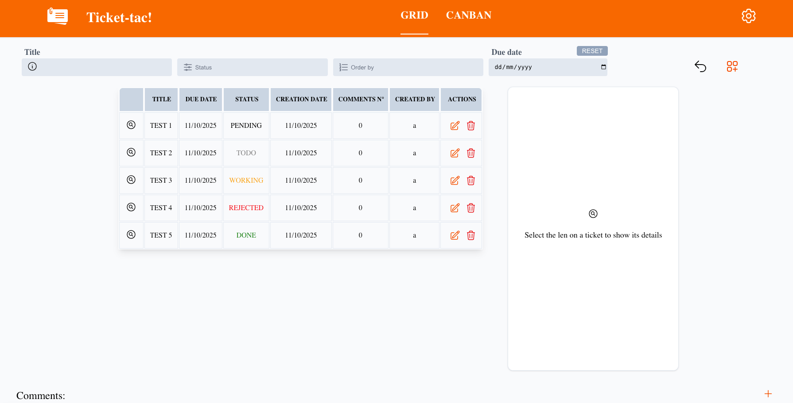
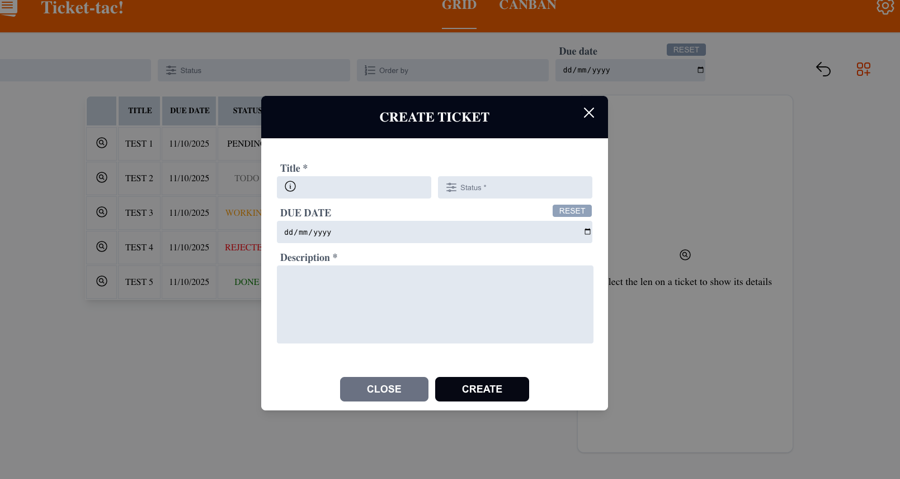
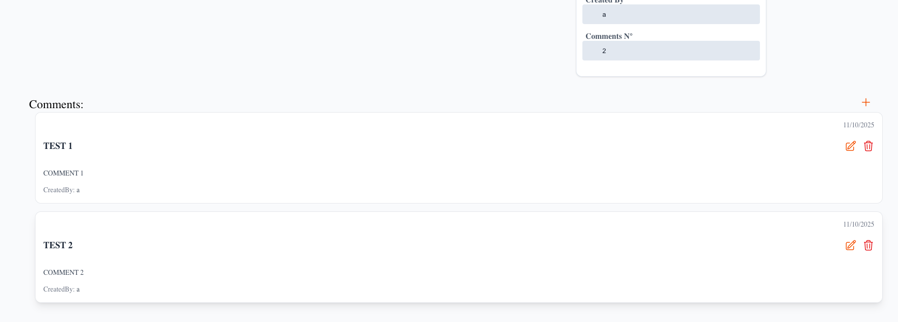
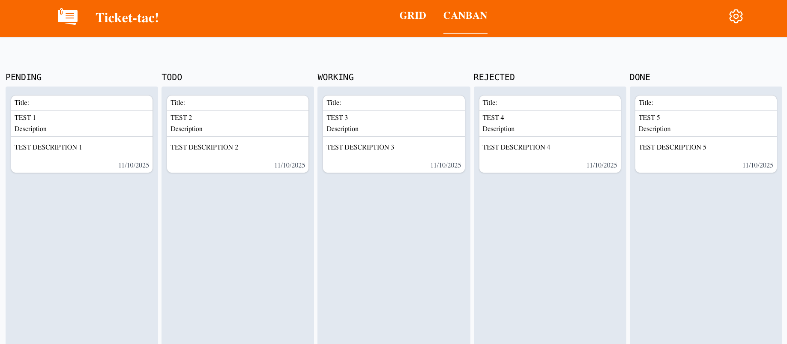

This is Ticket-tac app! The app that will help you to easily manage ticket in different statuses.

## Getting Started
Make sure to have a ```.env``` file with this fields:

```
MONGODB_URI=mongodb://{{YOUR_MONGO_DB_URL}}/{{DB_NAME}}
JWT_SECRET={{RANDOM_GENERATED_SECRET}}
```

First, run the development server:

```bash
npm run dev
# or
yarn dev
# or
pnpm dev
# or
bun dev
```

Open [http://localhost:3000](http://localhost:3000) with your browser to see the result.


## LOGIN
#### This it the ```LOGIN PAGE``` where you can create a new account or login to the system.


#### Creating a new account is very simple, just click on Sign up and enter at least the required infos inside the modal shown below. Once your account is created you can login to the system!


#### On the homepage you can insert and/or search for saved tickets, adding query criteria to simplify your search.


#### As shown below this whould be the case in which there will be tickets available.



#### To handle ticket creation/update you can use the modal, easy to use and minimalistic to let you focus on what to do!



### Here is the way to manage comments for the selected ticket, having the creation date and audit based on user creation.


#### Last but not the least, we have an amazing canban view to instantly visualize the tickets inside their relative status container.

